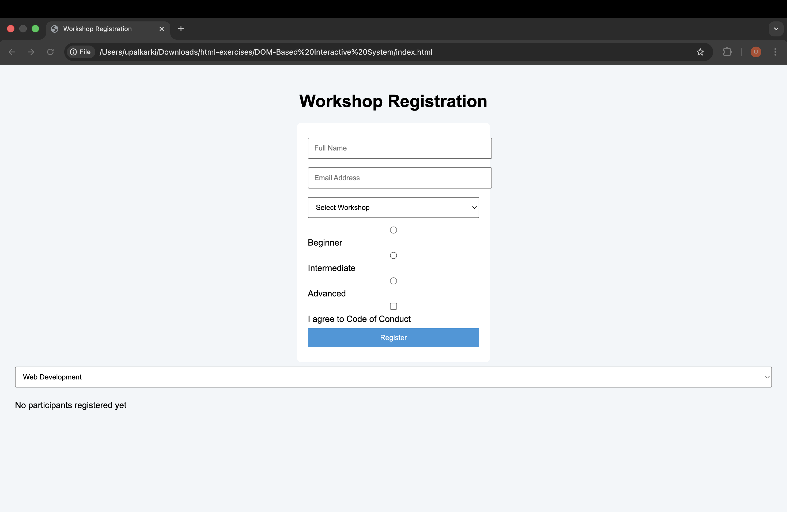

# DOM Based Workshop Registration System

## Technologies Used
HTML5  
CSS3  
Vanilla JavaScript (DOM only)

## Features Implemented
- Form validation using DOM
- Dynamic participant creation
- Remove participant with DOM
- Priority handling with class toggling
- Workshop filter using visibility control
- Empty state handling

## DOM Concepts Used
- getElementById
- querySelector
- createElement
- appendChild
- remove()
- classList.toggle()
- event delegation

## Challenges Faced
- Managing validation without alerts
- Reordering participants dynamically
- Keeping UI responsive using only DOM

## Future Feature (With Backend)
- User login system
- Database storage of participants
- Email notifications

## Screenshots 
- 