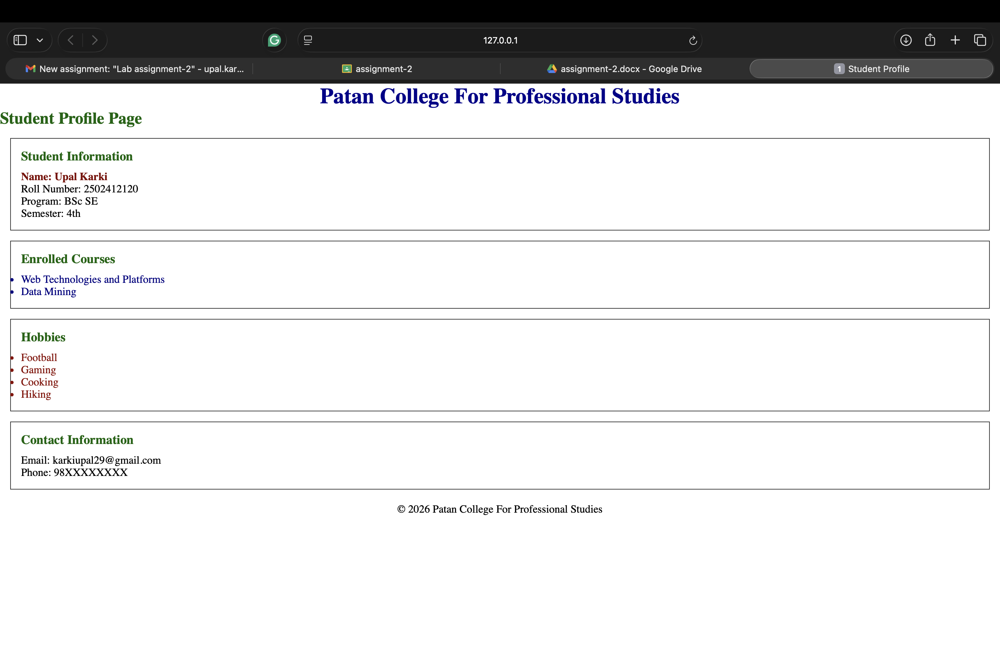
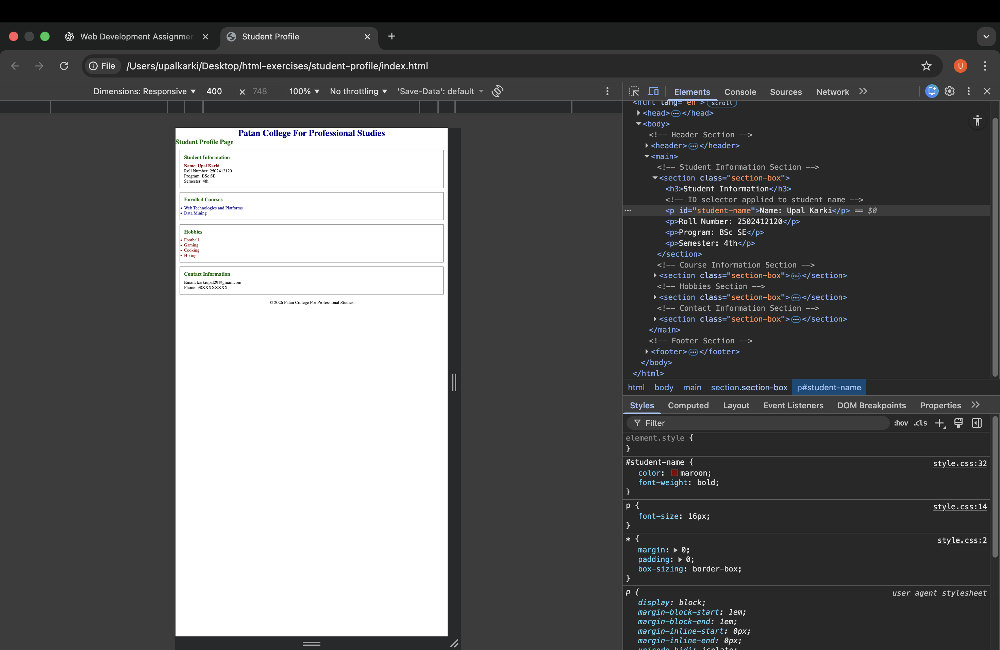

# Lab Assignment – 02  
HTML and CSS Fundamentals Using Selectors

## Assignment Title
Student Profile Web Page using HTML and CSS Selectors

## Brief Description
This project is created as part of Lab Assignment–02 for the course
Web Technologies and Platforms. The objective is to design a student
profile webpage using semantic HTML elements and apply styling using
external CSS with element, class, ID, group, descendant, and universal
selectors only.

Advanced CSS techniques and JavaScript are strictly avoided as per
assignment requirements.

## Steps to Run the Project
1. Clone or download the repository from GitHub.
2. Open the `student-profile` folder.
3. Open `index.html` in any modern web browser.
4. Use browser inspect tools to analyze applied CSS selectors.

## Screenshots

### Web Page Output

### CSS Inspection

## GitHub Profile
https://github.com/UpalKarki/student-performance-analysis.git
