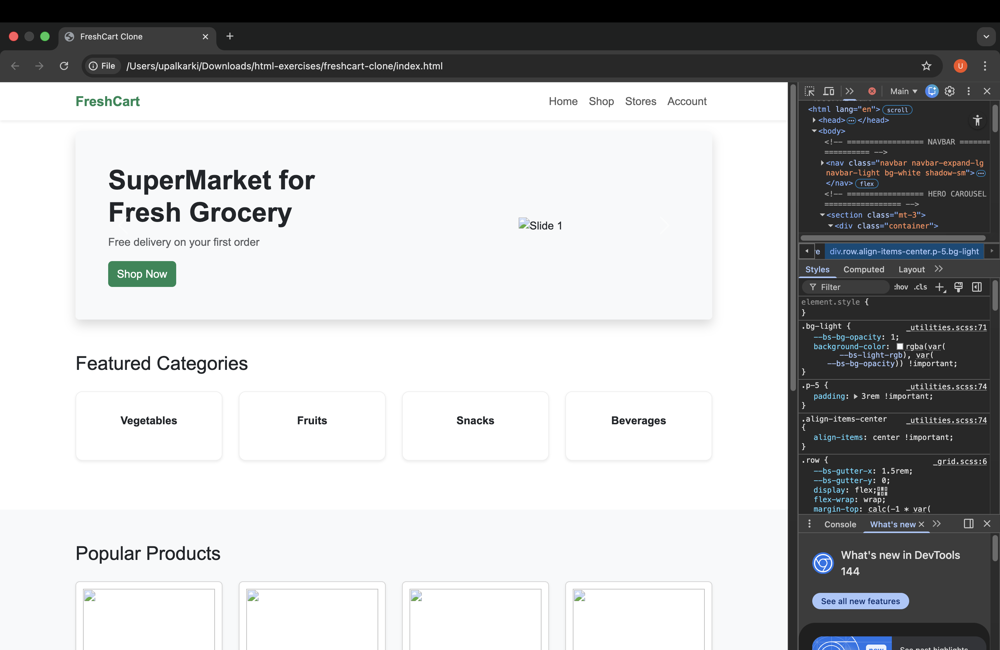
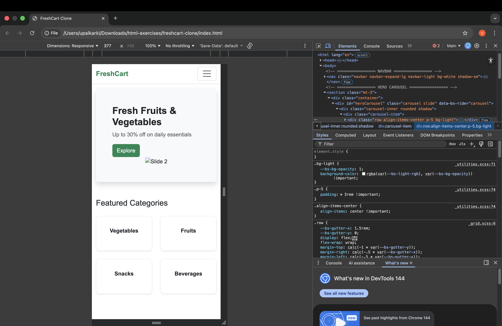

# FreshCart Website Clone

## Reference Website
https://themewagon.github.io/freshcart/?authuser=1

## Project Description
This project is a **responsive front-end clone** of the **FreshCart e-commerce
website** created for academic purposes.

The goal of this assignment is to replicate the **design, layout, and user
interface** of the reference website using **HTML, CSS, and Bootstrap 5**.
The project includes a hero carousel, category section, product grid, and
footer, closely resembling the original FreshCart homepage.

No backend or JavaScript business logic is implemented.

## Technologies Used
- HTML5
- CSS3
- Bootstrap 5

## Features
- Responsive navigation bar
- Hero carousel / slider
- Featured categories section
- Popular products grid with multiple product cards
- Clean and semantic HTML structure
- Fully responsive design using Bootstrap grid system

## Folder Structure

## Screenshots

### Desktop View

### Mobile View

## How to Run the Project
1. Clone or download the repository from GitHub.
2. Open the project folder.
3. Open `index.html` in any modern web browser.
4. Resize the browser to see responsive behavior.

## Disclaimer
This project is created **only for educational purposes** as part of a
Website Clone Assignment. All design inspiration belongs to the original
FreshCart website.
