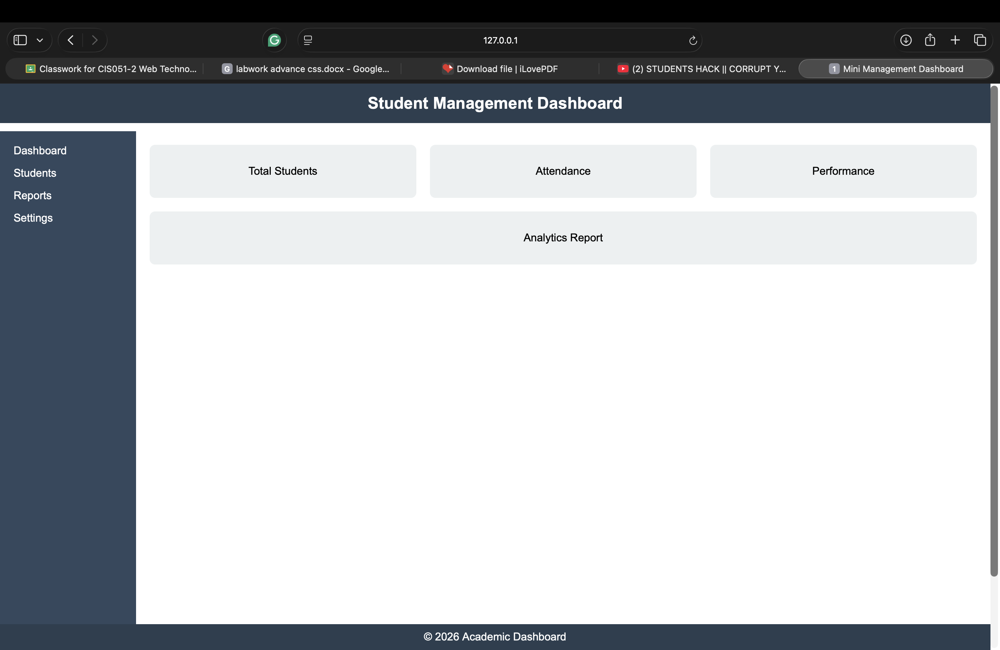

# Mini Management Dashboard

## Lab Title
Understanding Modern CSS Layout Techniques Through Practical UI Design

## Description
This project is a mini management dashboard created using HTML and CSS. 
It demonstrates the use of modern CSS layout techniques such as Position, Flexbox, Grid, and Media Queries to build a responsive user interface.

## Technologies Used
- HTML5
- CSS3

## Features
- Fixed header and footer
- Sidebar navigation
- Dashboard cards
- Responsive layout for mobile devices

## Steps to Run the Project
1. Download or clone the repository
2. Open the folder in VS Code
3. Open `index.html` in any web browser

## Screenshot

