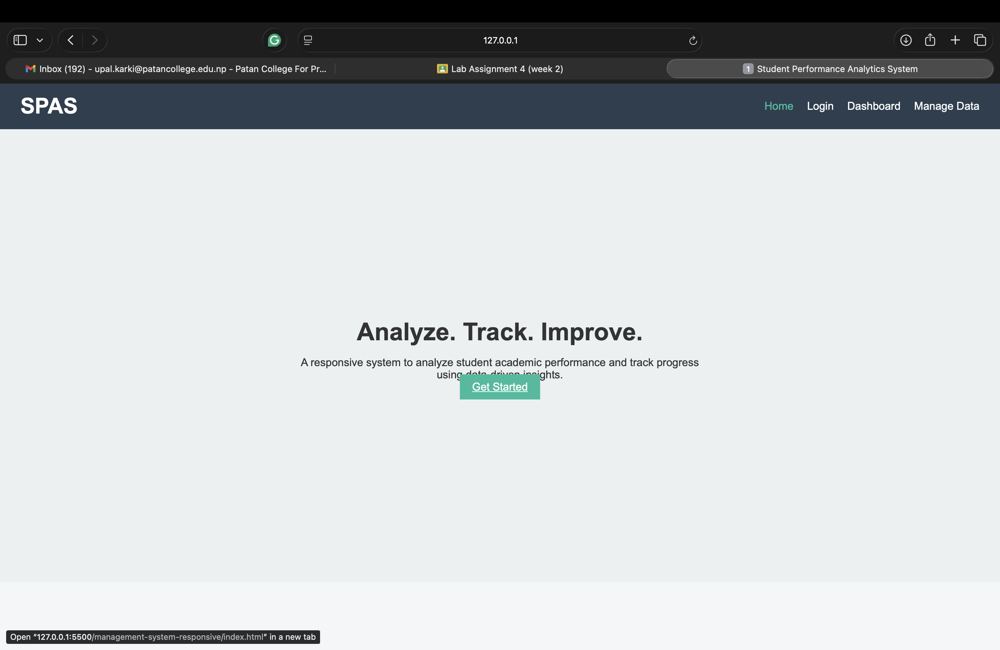
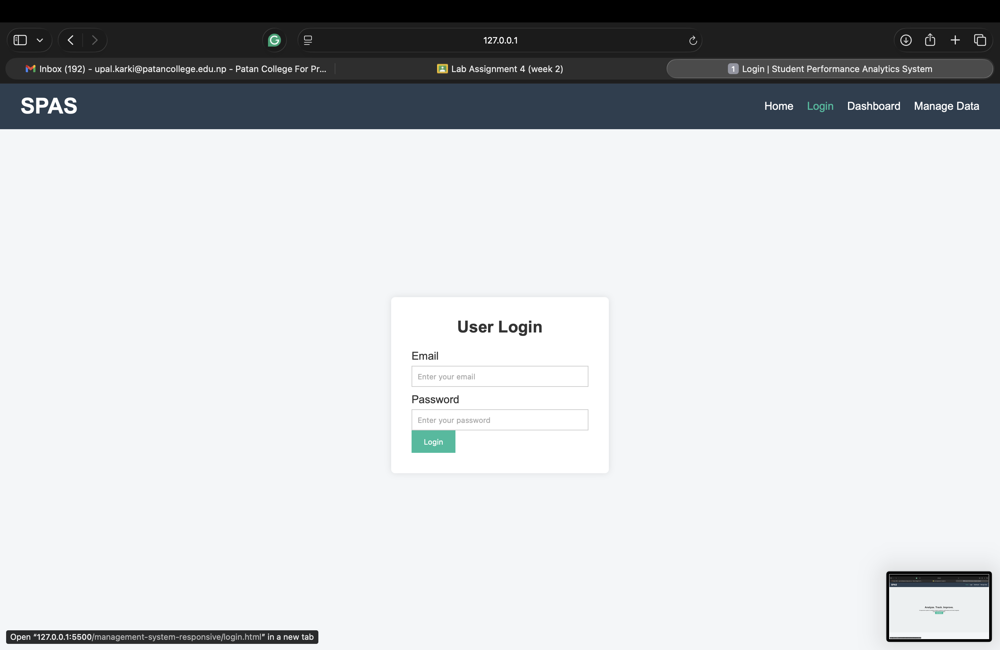
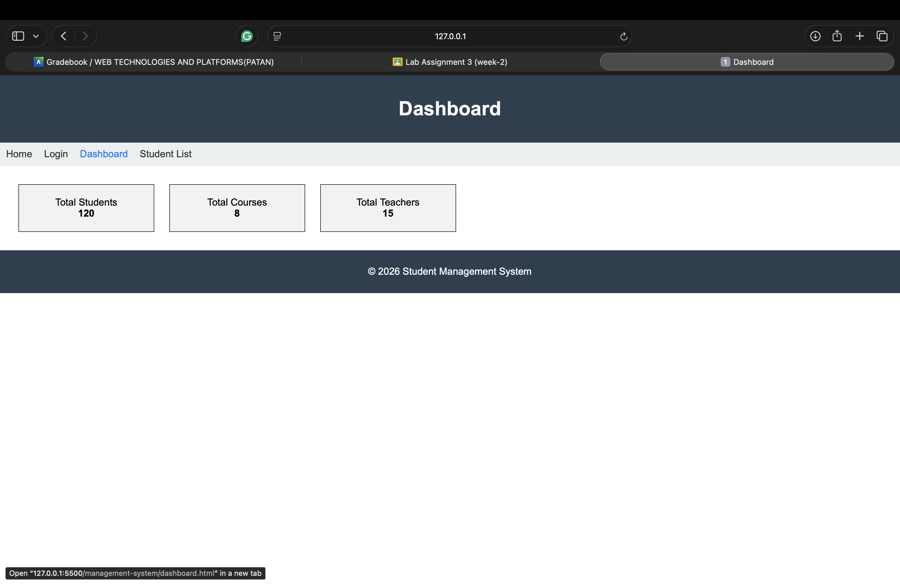
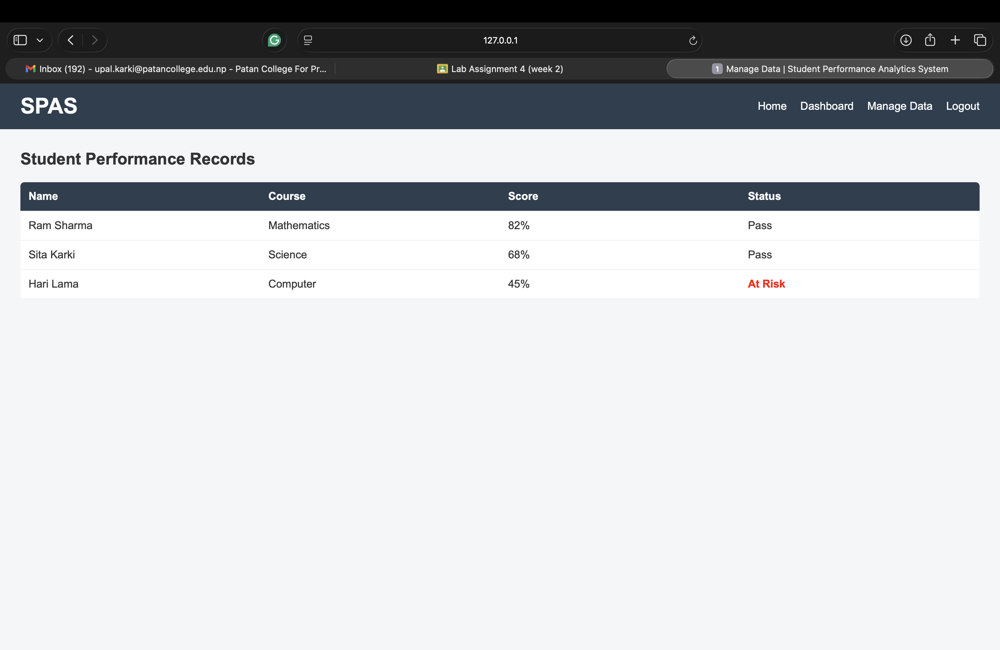

# Student Performance Analytics and Management System

## Description
This is a responsive, management-oriented web application designed to analyze and manage student academic performance. The system includes a landing page, login interface, dashboard with analytics, and a data management page. The layout is built using modern CSS techniques such as Flexbox, Grid, animations, and media queries.

## Technologies Used
- HTML5
- CSS3 (Flexbox, Grid, Media Queries, Animations)

## Steps to Run the Project
1. Download or clone the repository.
2. Open the project folder in Visual Studio Code.
3. Right-click `index.html` and select **Open with Live Server**  
   OR  
   Double-click `index.html` to open in a browser.
4. Navigate using the menu to access different pages.

## 📸 Screenshots

### Landing Page

### Login Page

### Dashboard

### Manage Data Page

### Responsive View (Mobile)

